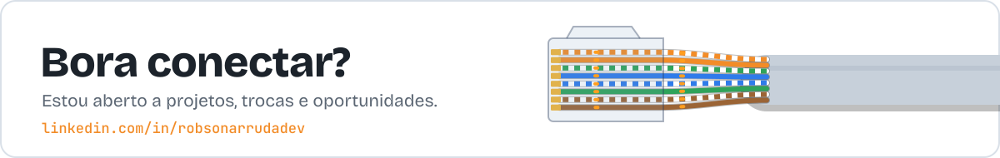

<picture>
  <source media="(prefers-color-scheme: dark)" srcset="assets/header-dark.svg">
  
</picture>

## Sobre mim

Comecei na infraestrutura de redes, cuidando da parte que faz tudo funcionar sem ninguém ver. Hoje estou do outro lado do cabo: desenvolvo sites, APIs e sistemas web com JavaScript, TypeScript, React e Node.js.

Ter vindo da rede mudou o jeito como eu penso uma aplicação. Eu olho o caminho inteiro de uma requisição, do navegador até o banco de dados, e não só a tela.

Faço sites para negócios de verdade, como o da Açaináticos, e sigo construindo meus próprios sistemas, como o HelpDesk Pro.

## Stack

<picture>
  <source media="(prefers-color-scheme: dark)" srcset="assets/stack-dark.svg">
  
</picture>

## Projetos em destaque

<table>
  <tr>
    <td width="50%" valign="top">
      <a href="https://robs788.github.io/sisoli-site/"><picture>
        <source media="(prefers-color-scheme: dark)" srcset="assets/card-sisoli-dark.svg">
        
      </picture></a>
      
<a href="https://robs788.github.io/sisoli-site/">ver o site</a> | <a href="https://github.com/ROBs788/sisoli-site">código</a>

    </td>
    <td width="50%" valign="top">
      <a href="https://site-acainaticos.vercel.app"><picture>
        <source media="(prefers-color-scheme: dark)" srcset="assets/card-acainaticos-dark.svg">
        
      </picture></a>
      
<a href="https://site-acainaticos.vercel.app">ver o site</a> | <a href="https://github.com/ROBs788/site-acainaticos">código</a>

    </td>
  </tr>
  <tr>
    <td width="50%" valign="top">
      <a href="https://github.com/ROBs788/dev-burguer-api"><picture>
        <source media="(prefers-color-scheme: dark)" srcset="assets/card-devburguer-dark.svg">
        
      </picture></a>
      
<a href="https://github.com/ROBs788/dev-burguer-api">código da API</a> | <a href="https://github.com/ROBs788/devburguer-interface">código da interface</a>

    </td>
    <td width="50%" valign="top">
      <a href="https://github.com/ROBs788/helpdeskpro"><picture>
        <source media="(prefers-color-scheme: dark)" srcset="assets/card-helpdesk-dark.svg">
        
      </picture></a>
      
<a href="https://github.com/ROBs788/helpdeskpro">código</a>

    </td>
  </tr>
</table>

## Outros projetos

| Projeto | O que é | Feito com | Links |
| --- | --- | --- | --- |
| **CynclyFlix** | Catálogo de filmes com tipagem estrita e dados locais, que funciona mesmo sem API | React, TypeScript, Vite | [código](https://github.com/ROBs788/cyncly-flix) |
| **Mercado Livre Clone** | Página de ofertas de Black Friday inspirada no Mercado Livre | HTML, CSS, JavaScript | [ver online](https://robs788.github.io/MERCADO-LIVRE-CLONE/) \| [código](https://github.com/ROBs788/MERCADO-LIVRE-CLONE) |
| **Conversor de Moedas** | Converte entre real, dólar, euro, libra e bitcoin, com formatação de moeda | HTML, CSS, JavaScript | [ver online](https://robs788.github.io/CONVERSOR-DE-MOEDAS/) \| [código](https://github.com/ROBs788/CONVERSOR-DE-MOEDAS) |
| **Netric** | Landing page de um app de conexões entre pessoas, com animações ao rolar a página | HTML, CSS, JavaScript | [código](https://github.com/ROBs788/Netric) |
| **Starbucks** | Landing page inspirada na Starbucks | HTML, CSS | [código](https://github.com/ROBs788/starbucks-main) |
| **Dev Sorteio** | Sorteador de números | HTML, CSS, JavaScript | [código](https://github.com/ROBs788/DEV-SORTEIO-Dev-Club) |

 

<a href="https://www.linkedin.com/in/robsonarrudadev">
  <picture>
    <source media="(prefers-color-scheme: dark)" srcset="assets/footer-dark.svg">
    
  </picture>
</a>
